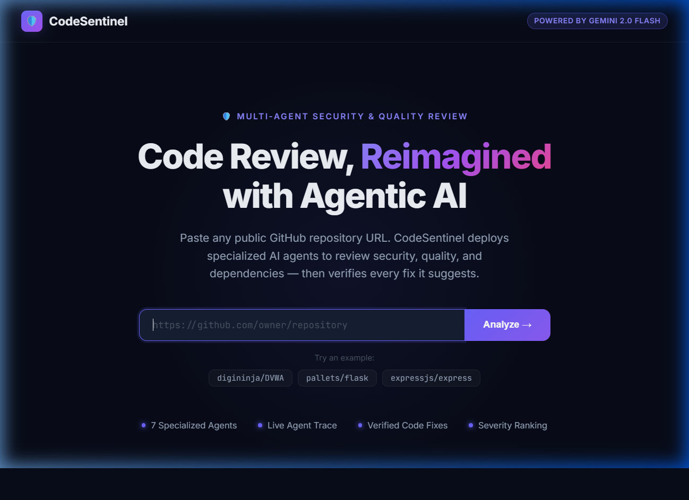
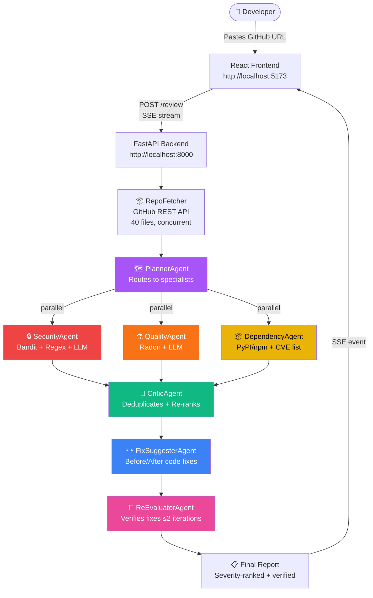

<div align="center">



# CodeSentinel — Agentic Code Review System

**A multi-agent AI system that reviews any public GitHub repository for security vulnerabilities, code quality issues, and dependency risks — then verifies every fix it suggests.**

[](https://www.python.org/)
[](https://fastapi.tiangolo.com/)
[](https://react.dev/)
[](https://ai.google.dev/)
[](https://ollama.com/)
[](LICENSE)

</div>

---

## What is CodeSentinel?

CodeSentinel deploys **7 specialized AI agents** in a coordinated pipeline to review any public GitHub repository. Unlike single-LLM tools that make one-shot suggestions, CodeSentinel:

- 🔍 **Specializes** — separate agents for security, quality, and dependency analysis
- 🔄 **Verifies** — a Re-Evaluator agent checks every suggested fix (up to 2 iterations)
- 📡 **Streams live** — you watch each agent think in real time via Server-Sent Events
- 🔀 **Dual backend** — switch between Google Gemini (cloud) and Ollama (local, free) with one env var

---

## Demo

> Analyzed `digininja/DVWA` (Damn Vulnerable Web Application — intentionally insecure):

| Metric | Result |
|---|---|
| Files analyzed | 40 |
| Critical findings | 2 (Command Injection, File Inclusion) |
| High findings | 1 (Information Disclosure) |
| Medium findings | 4 (CSRF, Session Management, Input Validation...) |
| Fixes suggested & verified | ✅ |

---

## Architecture



---

## Agent Pipeline

| # | Agent | Role | Tools Used |
|---|---|---|---|
| 1 | **RepoFetcher** | Fetches up to 40 relevant files from GitHub | GitHub REST API (concurrent) |
| 2 | **PlannerAgent** | Analyzes repo structure, routes tasks to specialists | LLM |
| 3 | **SecurityAgent** | Finds SQL injection, secrets, command injection, unsafe patterns | Bandit, regex secret scanner, LLM |
| 4 | **QualityAgent** | Checks complexity, dead code, missing error handling | Radon (cyclomatic complexity), LLM |
| 5 | **DependencyAgent** | Detects outdated/vulnerable packages | PyPI registry, npm registry, CVE list, LLM |
| 6 | **CriticAgent** | Deduplicates and re-ranks all findings, writes executive summary | LLM |
| 7 | **FixSuggesterAgent** | Generates before/after code fixes for Critical/High findings | LLM |
| 8 | **ReEvaluatorAgent** | Verifies each fix is correct; loops up to 2× if insufficient | LLM |

### Fix Verification Loop

```
FixSuggester → ReEvaluator
                    ↓
              [Verified ✓]  → Final Report
                    ↓
              [Insufficient] → FixSuggester (2nd attempt) → ReEvaluator → Final Report
```

---

## Tech Stack

### Backend
| Package | Version | Purpose |
|---|---|---|
| `fastapi` | 0.136 | REST API + SSE streaming |
| `uvicorn` | 0.45 | ASGI server |
| `google-genai` | 1.73 | Gemini 2.0 Flash API |
| `httpx` | 0.28 | Async HTTP (GitHub API + Ollama) |
| `pydantic` | 2.13 | Data validation |
| `bandit` | 1.9 | Python security static analysis |
| `radon` | 6.0 | Code complexity metrics |
| `packaging` | 26 | Semver comparison for CVE checking |
| `python-dotenv` | 1.2 | Environment variable loading |

### Frontend
| Package | Purpose |
|---|---|
| `react` + `vite` | UI framework + dev server |
| `react-syntax-highlighter` | Before/after code diffs with syntax highlighting |
| `lucide-react` | Icons |

---

## Project Structure

```
CodeSentinel/
├── backend/
│   ├── main.py                  # FastAPI app — SSE orchestration pipeline
│   ├── config.py                # Environment variables + constants
│   ├── models.py                # Pydantic schemas (Finding, Report, AgentPlan...)
│   ├── gemini_client.py         # Unified LLM client (Gemini + Ollama routing)
│   ├── requirements.txt
│   ├── .env                     # Your secrets (not committed)
│   ├── .env.example
│   ├── agents/
│   │   ├── planner.py           # PlannerAgent
│   │   ├── security.py          # SecurityAgent + shared _parse_findings()
│   │   ├── quality.py           # QualityAgent
│   │   ├── dependency.py        # DependencyAgent
│   │   ├── critic.py            # CriticAgent
│   │   ├── fix_suggester.py     # FixSuggesterAgent
│   │   └── re_evaluator.py      # ReEvaluatorAgent
│   └── tools/
│       ├── github_fetcher.py    # GitHub REST API — concurrent file fetching
│       └── code_runner.py       # Bandit / Radon / regex secret scanner
└── frontend/
    ├── index.html
    ├── vite.config.js           # Dev proxy → localhost:8000
    └── src/
        ├── App.jsx              # SSE stream reader + state machine
        ├── index.css            # Dark-mode design system (glassmorphism)
        └── components/
            ├── URLInput.jsx     # Hero URL input with example quick-fills
            ├── AgentTrace.jsx   # Left panel — live agent event list
            ├── AgentCard.jsx    # Individual agent card with status/spinner
            ├── FinalReport.jsx  # Right panel — stats + severity filter
            ├── FindingCard.jsx  # Expandable finding with before/after diff
            └── SkeletonLoader.jsx
```

---

## Setup & Running

### Prerequisites

- Python 3.11+
- Node.js 18+
- **Gemini API key** (free) — OR — **Ollama** installed locally

---

### 1. Clone & Backend Setup

```bash
git clone https://github.com/yourname/CodeSentinel.git
cd CodeSentinel/backend

# Create and activate virtual environment
python -m venv .venv

# Windows
.venv\Scripts\activate
# Mac/Linux
source .venv/bin/activate

pip install -r requirements.txt
```

---

### 2. Configure Environment

Copy the example and fill in your values:

```bash
cp .env.example .env
```

Open `backend/.env`:

```env
# Choose your LLM backend
LLM_BACKEND=gemini          # or "ollama" for fully local/free

# Gemini (get free key at https://aistudio.google.com/apikey)
GOOGLE_API_KEY=AIza...

# Ollama (local — see section below)
OLLAMA_BASE_URL=http://localhost:11434
OLLAMA_MODEL=mistral

# GitHub token (optional — increases rate limit 60 → 5000 req/hr)
GITHUB_TOKEN=ghp_...
```

---

### 3. LLM Backend Options

#### Option A — Google Gemini (Recommended for quality)

1. Go to **https://aistudio.google.com/apikey**
2. Click **"Create API key"** → free tier, no credit card needed
3. Paste the key into `GOOGLE_API_KEY` in `.env`
4. Set `LLM_BACKEND=gemini`

> **Free tier limits:** 15 requests/min, 1500 requests/day for `gemini-2.0-flash`  
> If you hit quota: wait until midnight (Pacific time) or create a key from another Google account.

#### Option B — Ollama (Fully local, unlimited, free)

1. Install Ollama from **https://ollama.com/download**
2. Pull a model:
   ```bash
   ollama pull mistral          # 4.4 GB — good general model
   ollama pull qwen2.5-coder    # 4.7 GB — better for code analysis
   ollama pull llama3.1         # 4.7 GB — best instruction following
   ```
3. Start Ollama (if not auto-started):
   ```bash
   ollama serve
   ```
4. Set in `.env`:
   ```env
   LLM_BACKEND=ollama
   OLLAMA_MODEL=mistral         # or qwen2.5-coder / llama3.1
   ```

> **Model quality comparison:**  
> `Gemini 2.0 Flash` > `Qwen2.5-Coder` > `Llama3.1` > `Mistral` for this task.  
> Mistral works but gives directory-level findings instead of file+line precision.

---

### 4. GitHub Token (Optional but Recommended)

Without a token GitHub allows **60 API requests/hour** (shared by IP).  
With a token: **5,000 requests/hour**.

1. Go to **https://github.com/settings/tokens**
2. Click **"Generate new token (classic)"**
3. Set a name (e.g. `CodeSentinel`)
4. Select scope: **`public_repo` only** (read-only public repos — this is all that's needed)
5. Generate → copy the `ghp_...` token
6. Paste into `GITHUB_TOKEN` in `.env`

---

### 5. Start Backend

```bash
# From backend/ directory (with venv active)
uvicorn main:app --reload --host 0.0.0.0 --port 8000
```

Verify it's running:
```bash
curl http://localhost:8000/health
# → {"status":"ok","backend":"gemini","model":"gemini-2.0-flash-lite","api_key_set":true}
```

---

### 6. Start Frontend

```bash
# From frontend/ directory
npm install
npm run dev
```

Open **http://localhost:5173**

---

## Using CodeSentinel

1. Paste any **public** GitHub repository URL
2. Click **Analyze →** (or pick one of the example repos)
3. Watch the **Agent Trace** panel (left) update live as each agent runs
4. The **Review Report** panel (right) populates when complete
5. Click any finding to expand it — Critical/High findings show a **verified before/after code fix**

### Good repos to test with

| Repository | Why it's interesting |
|---|---|
| `https://github.com/digininja/DVWA` | Intentionally vulnerable — many real findings |
| `https://github.com/pallets/flask` | Well-maintained — tests false-positive rate |
| `https://github.com/expressjs/express` | Node.js — tests multi-language support |
| `https://github.com/pypa/pip` | Large Python project — tests scale |

---

## API Reference

### `POST /review`
Starts a repository review. Returns a **Server-Sent Events** stream.

**Request:**
```json
{ "repo_url": "https://github.com/owner/repo" }
```

**SSE Event Types:**

| Event | Payload | When |
|---|---|---|
| `agent_update` | `{agent, status, message, timestamp, ...}` | Each agent state change |
| `report_complete` | Full `FinalReport` JSON object | Pipeline complete |
| `error` | `{message}` | Any fatal error |

**Agent status values:** `running` → `complete` / `error`

### `GET /health`
```json
{"status": "ok", "backend": "ollama", "model": "mistral", "ollama_url": "http://localhost:11434"}
```

---

## Switching Backends

No code changes needed — just edit `.env` and the backend hot-reloads:

```env
# Use Gemini
LLM_BACKEND=gemini

# Use Ollama
LLM_BACKEND=ollama
OLLAMA_MODEL=qwen2.5-coder
```

---

## Known Limitations

| Limitation | Notes |
|---|---|
| **Public repos only** | GitHub API without auth only accesses public repos |
| **Max 40 files** | Configurable via `MAX_FILES` in `config.py` |
| **PHP/Java static analysis** | Bandit and Radon only support Python; other languages rely on LLM only |
| **Local model precision** | 7B models (Mistral, etc.) give directory-level findings; Gemini gives file+line |
| **Gemini free tier quota** | 1,500 requests/day; use Ollama for unlimited local runs |
| **No private repos** | Would require OAuth flow — not implemented |

---

## How the SSE Stream Works

```
Browser                    Vite Proxy              FastAPI
   |                           |                      |
   |── POST /review ──────────>|── POST /review ─────>|
   |                           |                      | [runs pipeline]
   |<── event: agent_update ───|<─ SSE chunk ─────────|
   |<── event: agent_update ───|<─ SSE chunk ─────────|
   |         ...               |       ...            |
   |<── event: report_complete─|<─ final chunk ───────|
   |                           |                      |
```

The frontend reads the stream with `response.body.getReader()` and updates React state incrementally — no WebSocket needed.

---

## Contributing

1. Fork the repo
2. Create a feature branch: `git checkout -b feature/new-agent`
3. Add your agent in `backend/agents/`
4. Register it in `main.py`'s `run_pipeline()` 
5. Submit a PR

---

## License

MIT License — see [LICENSE](LICENSE) for details.

---

<div align="center">
Built with ❤️ using Google Gemini 2.0 Flash, FastAPI, and React
</div>
